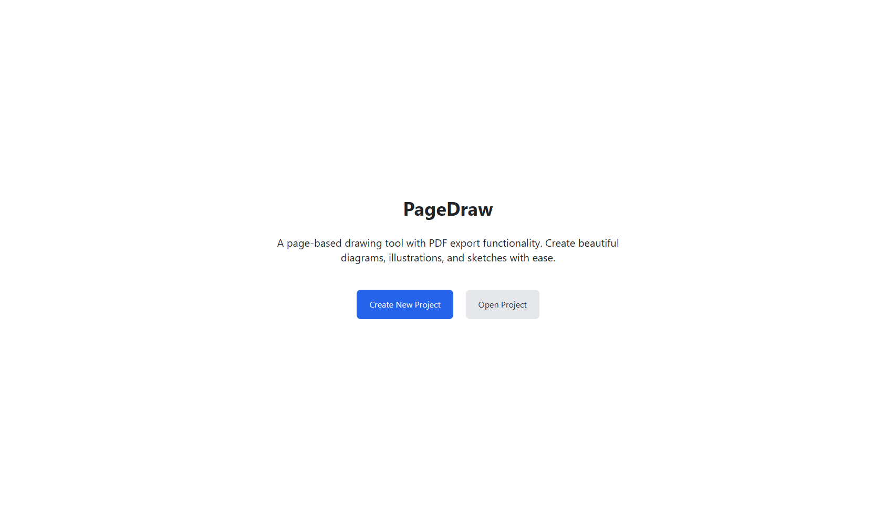
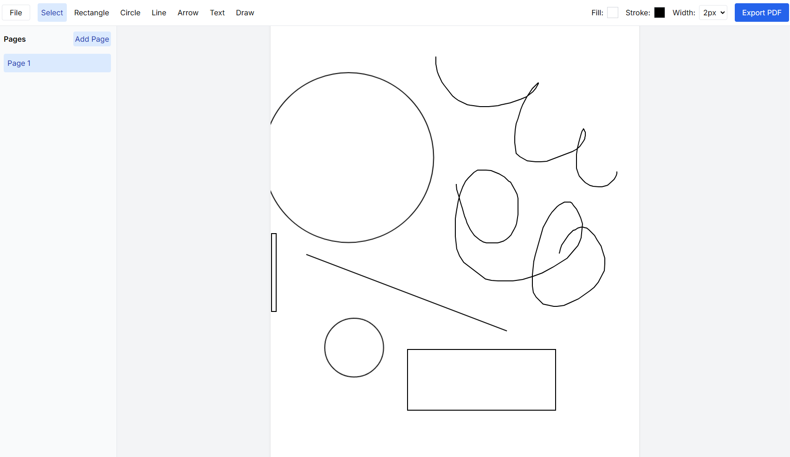

# PageDraw

A page-based diagramming tool built with Next.js that allows for PDF export. This project was entirely done with Claude 3.7 Sonnet - I wrote none of the code myself.



## Claude Prompt:
```
I want a platform like exacalidraw but with pages and not an infinite canvas, use NextJS and make it possible to export the pages as pdf, start by listing features we want and a plan to implement
```

## Features

- **Page-based Canvas System**: Create diagrams on discrete pages rather than an infinite canvas

- **Drawing Tools**: Rectangle, circle, line, arrow, text, and freehand drawing
- **Styling Options**: Customize colors, stroke width, and more
- **Page Management**: Add, remove, and navigate between pages
- **Export to PDF**: Export your entire project as a PDF

## Tech Stack

- **Frontend**: Next.js 14 with TypeScript and App Router
- **Styling**: TailwindCSS
- **State Management**: Zustand
- **Canvas Rendering**: Fabric.js
- **PDF Generation**: jsPDF

## Getting Started

1. **Clone the repository**

```bash
git clone https://github.com/Michaelgathara/mdraw.git
cd mdraw
```

2. **Install dependencies**

```bash
npm install
```

3. **Run the development server**

```bash
npm run dev
```

Open [http://localhost:3000](http://localhost:3000) with your browser to see the result.

## Project Structure

```
src/
├── app/                  # Next.js App Router
│   ├── editor/           # Editor page
│   ├── projects/         # Projects listing page
│   ├── layout.tsx        # Root layout
│   └── page.tsx          # Home page
├── components/           # React components
│   ├── canvas/           # Canvas-related components
│   └── ui/               # UI components
├── lib/                  # Utilities and helpers
│   ├── store/            # Zustand store
│   └── utils/            # Utility functions
```

## Key Components

- **PageCanvas**: The main drawing canvas component using Fabric.js
- **EditorToolbar**: The toolbar with drawing tools and export options
- **PageNavigation**: Component for managing and navigating between pages
- **PDF Export**: Utility for exporting the project to PDF

## Potential Roadmap

- [ ] Implement undo/redo functionality
- [ ] Add collaboration features
- [ ] Create templates system
- [ ] Add image import support
- [ ] Implement advanced connectors with anchor points

## License

[MIT](https://choosealicense.com/licenses/mit/)